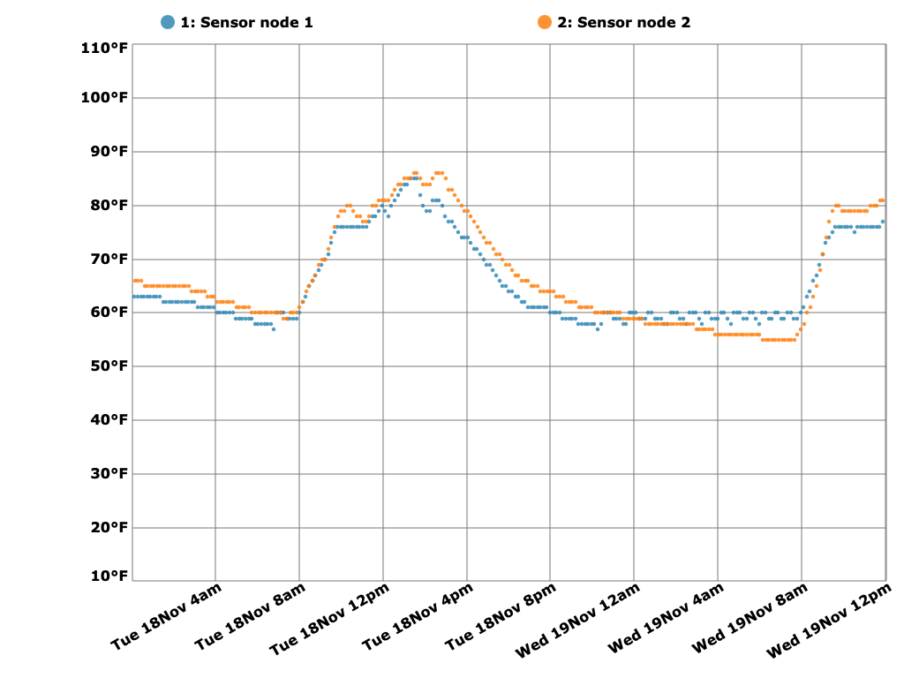

<!-- SPDX-License-Identifier: MIT -->
<!-- SPDX-FileCopyrightText: Copyright 2025 Sam Blenny -->
# Serial Sensor Hub



Hub to gather sensor data over USB serial, log it, chart it, and send
notifications by IRC.

Features:

1. Listen for lines of input from USB serial in the format sent by my
   [lora-greenhouse-monitor](https://github.com/samblenny/lora-greenhouse-monitor)
   temperature sensor base station

2. Log sensor reports to CSV files

3. Set the topic of an IRC channel to a sensor report summary message in the
   format supported by my
   [irc-display-bot](https://github.com/samblenny/irc-display-bot) desktop
   notification display

4. Serve a web page on port 8080 with a chart showing the last 36 hours of
   sensor data


## Installing Go

The sensor hub server is written in the Go programming language. You'll need
the Go compiler tools to build the server binary. If you don't have the Go
build tools, you can download them from [go.dev/dl/](https://go.dev/dl/).

The Go download page has links at the top for macOS on ARM and Linux on Intel.
For Raspberry Pi, scroll down to the big list and find the download link ending
in `.linux-arm64.tar.gz`.

For this project, I'm using go1.25.4 on macOS, Raspberry Pi OS, and Debian:
- go1.25.4.darwin-arm64.pkg   (macOS on Apple Silicon)
- go1.25.4.linux-arm64.tar.gz (Raspberry Pi OS on ARM)
- go1.25.4.linux-amd64.tar.gz (Debian on Intel)

Install instructions are at [go.dev/doc/install](https://go.dev/doc/install).


## Build & Install Server

The server is meant to run either on macOS (for dev and testing) or on a
Raspberry Pi as a systemd service that starts each time the Pi boots up.


### Run Server in Developer Mode

To work on the server code, you can run it from a terminal (Ctrl-C to exit):

1. Clone this repo to your home directory (or wherever you want to put it)

   ```bash
   cd ~
   git clone https://github.com/samblenny/serial-sensor-hub.git
   cd serial-sensor-hub
   ```

2. Use your favorite text editor to edit `serial-sensor-hub/config.json` with
   the IP address, channel, and nick that you want to use for your IRC server.
   NOTE: this is meant for local IRC servers on a Raspberry Pi, so I didn't
   implement support for TLS or passwords.

   If you need help with setting up an IRC server, check out the
   [README for irc-display-bot](https://github.com/samblenny/irc-display-bot/blob/main/README.md#set-up-raspberry-pi-os-with-irc-server).

3. Start the server (Ctrl-C to exit when you're done):

   ```bash
   cd ~/serial-sensor-hub
   make run
   ```


### Install Server as Systemd Service

To install the server as a systemd service on a Raspberry Pi:

1. Build the server

   ```bash
   cd ~
   git clone https://github.com/samblenny/serial-sensor-hub.git
   cd serial-sensor-hub
   make serial-sensor-hub
   ```

2. Use your favorite text editor to edit `serial-sensor-hub/config.json` with
   the IP address, channel, and nick that you want to use for your IRC server.
   NOTE: this is meant for local IRC servers on a Raspberry Pi, so I didn't
   implement support for TLS or passwords.

   If you need help with setting up an IRC server, check out the
   [README for irc-display-bot](https://github.com/samblenny/irc-display-bot/blob/main/README.md#set-up-raspberry-pi-os-with-irc-server).

3. Use your favorite text editor to edit the `serial-sensor-hub.service`
   systemd service file with the correct `User=...` and `WorkingDirectory=...`
   values if your user account is not named `pi` or if you didn't clone the
   code into as `/home/pi/serial-sensor-hub`.

4. Copy the service file to `/etc/systemd/system/serial-sensor-hub.service` and
   run the systemd commands to enable and start it (so it will run now and also
   each time your Pi boots):

   ```bash
   cd ~/serial-sensor-hub
   sudo cp serial-sensor-hub.service /etc/systemd/system/
   sudo systemctl enable serial-sensor-hub
   sudo systemctl start serial-sensor-hub
   ```

To check on the server you can run:
- `systemctl status serial-sensor-hub` (see current status)
- `journalctl -u serial-sensor-hub` (read all the log messages)
